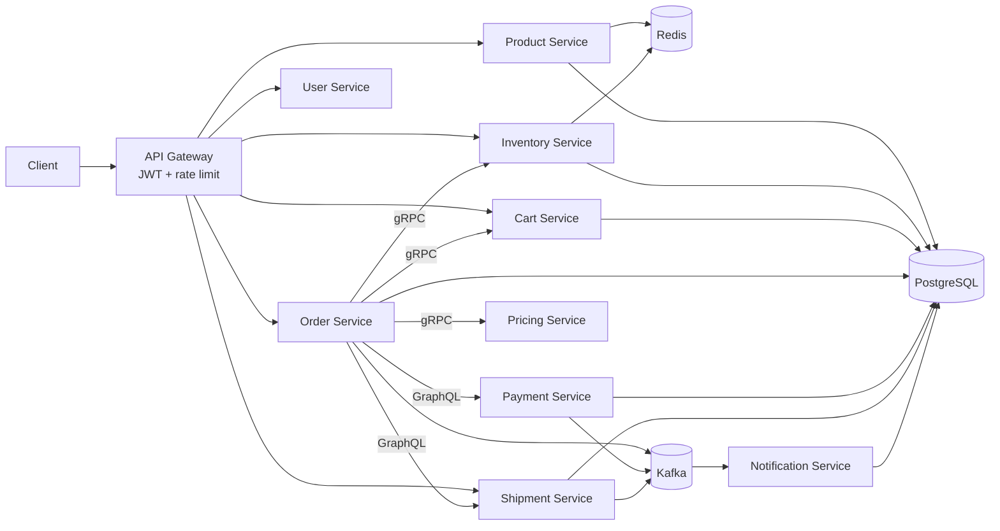

# Multi-Warehouse Order Fulfillment System

Java 21 / Spring Boot 4.1 microservices platform for product, inventory, cart, order, payment, shipment, and notification workflows.

## Architecture



## Run locally with Docker Compose

```bash
docker compose up --build
```

Services use PostgreSQL, Redis, Kafka, Eureka, and Prometheus defined in `docker-compose.yml`. The gateway is available at `http://localhost:8080`; Prometheus is available at `http://localhost:9090`.

## JWT authentication

Register a user, then obtain a JWT through the gateway GraphQL endpoint:

```bash
curl -X POST http://localhost:8080/auth/graphql \
  -H "Content-Type: application/json" \
  -d '{"query":"mutation { login(request: {userEmail: \"customer@example.com\", userPassword: \"password\"}) { token userId userName userEmail role } }"}'
```

Use the returned token for gateway requests:

```http
Authorization: Bearer <token>
```

The gateway validates credentials and roles through User Service's GraphQL mutation, then adds the role to the JWT. All routed GraphQL APIs require `Authorization: Bearer <token>`. The gateway rate-limits each client IP to 20 requests per minute by default. Set `RATE_LIMIT_REQUESTS_PER_MINUTE` to override it.

## Sample GraphQL requests

Create a product through the gateway:

```graphql
mutation {
  createProduct(product: {
    productSku: "SKU-1001"
    productName: "Wireless Keyboard"
    productDesc: "Compact keyboard"
    productCategory: "ELECTRONICS"
    productPrice: 1999
  }) {
    productId
    productName
  }
}
```

Add a cart item:

```graphql
mutation {
  addToCart(request: { userId: 1, productId: 1, quantity: 1 }) {
    cartId
    cartItems { productId quantity }
  }
}
```

Place an order:

```graphql
mutation {
  placeOrder(request: { userId: 1, paymentMethod: UPI }) {
    orderId
    orderStatus
    paymentStatus
  }
}
```

Track a shipment:

```graphql
query {
  shipmentByTrackingNumber(trackingNumber: "SHP-...") {
    shipmentStatus
    orderId
  }
}
```

## Monitoring

Every application exposes `/actuator/health` and `/actuator/prometheus`. Product catalog and inventory snapshots are cached with Redis. Prometheus scrape targets are in `monitoring/prometheus.yml`.

## Kubernetes

Apply the shared namespace, configuration, secrets, deployments, and services:

```bash
kubectl apply -f kubernetes/fulfillment.yaml
```

Replace the example images and secret values before a production deployment.
